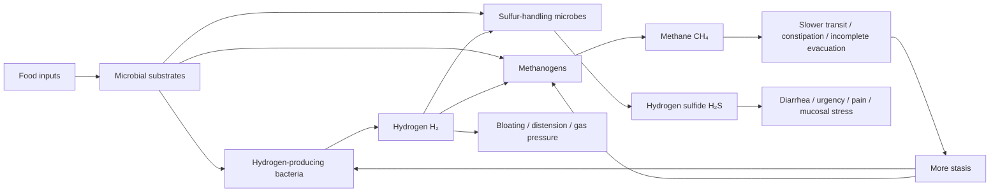
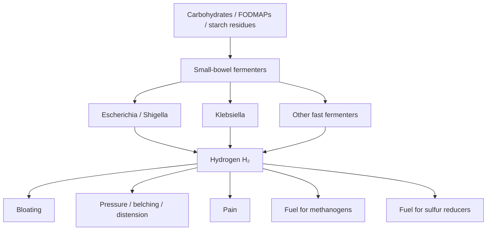
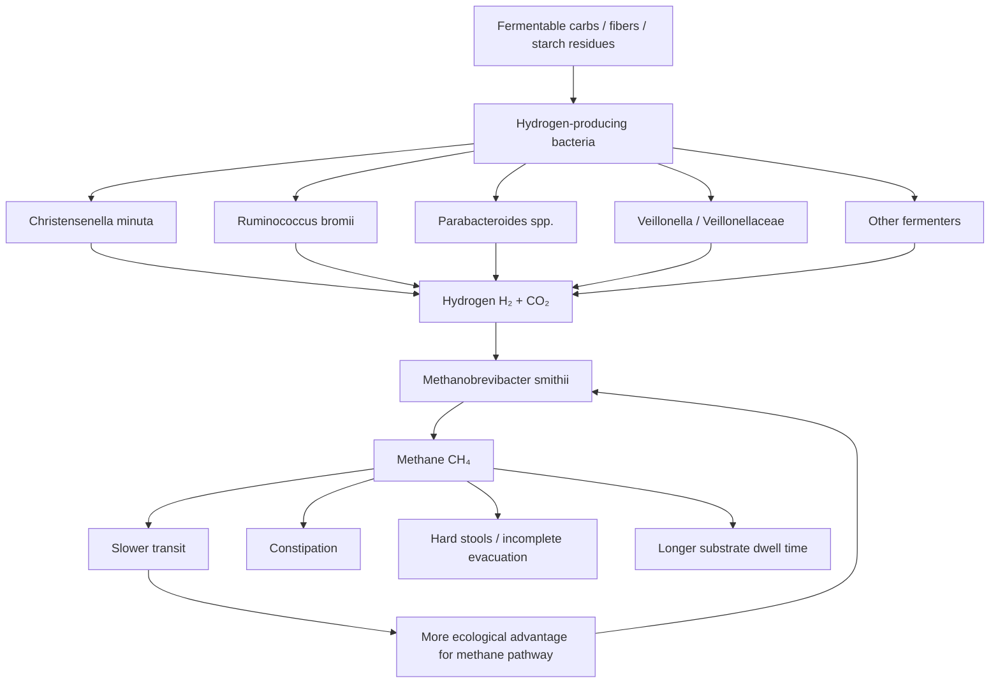
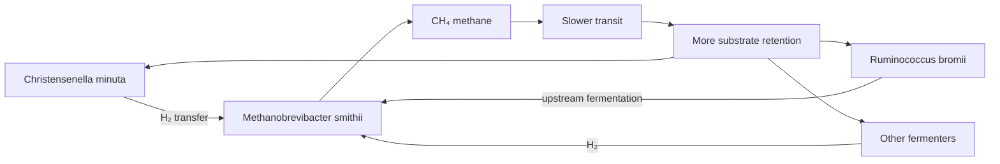
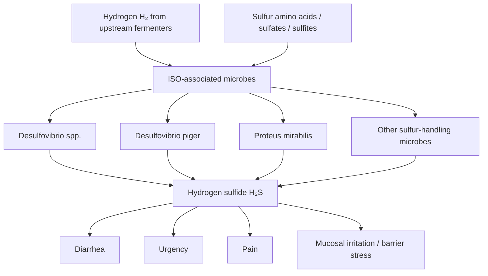
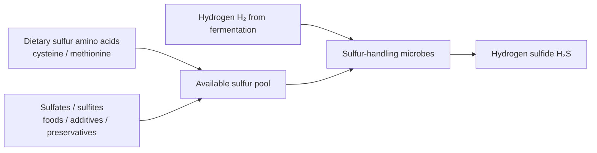
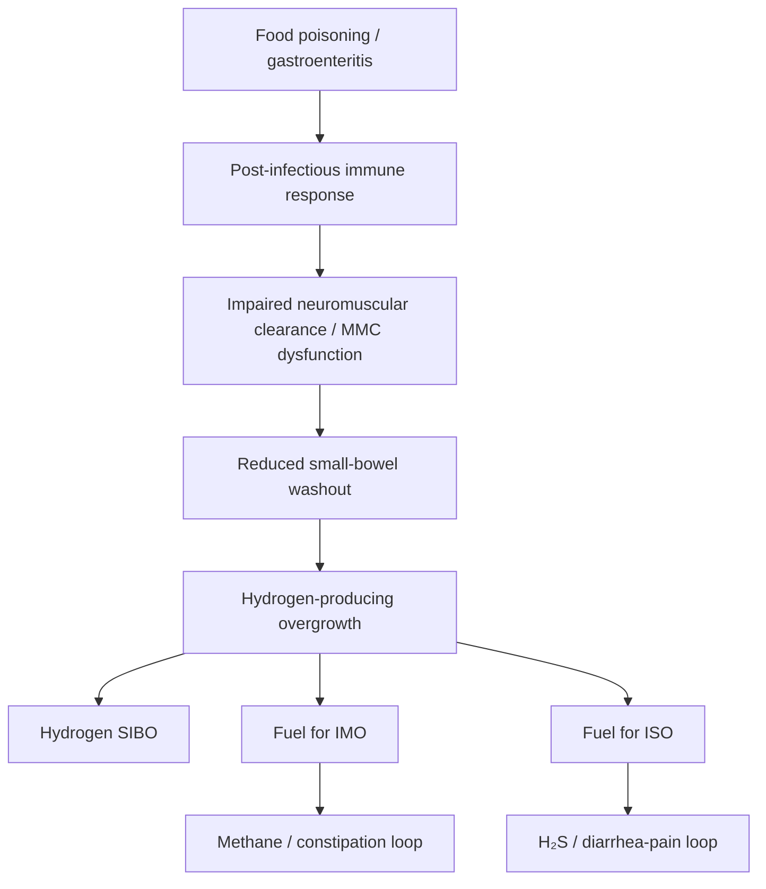
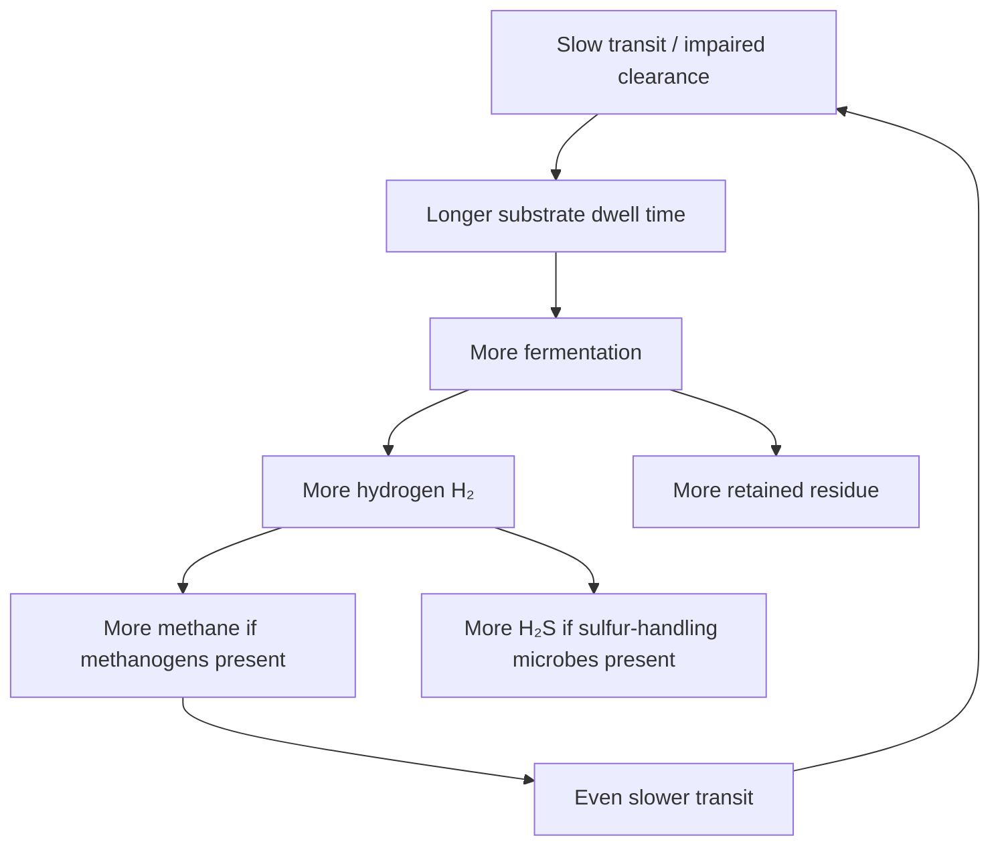
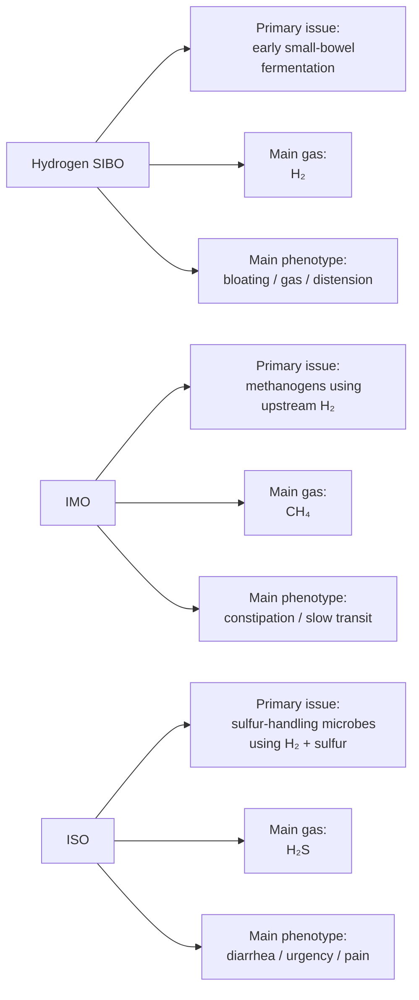

# Hydrogen SIBO vs IMO vs ISO

This article summarizes the current working model for three related but distinct overgrowth / overfermentation phenotypes in a consistent order:

1. **Hydrogen-predominant SIBO**
2. **Intestinal methanogen overgrowth (IMO)**
3. **Intestinal sulfide overproduction (ISO)**

The newer literature increasingly separates these into different gas-dominant patterns rather than treating them as one condition with one mechanism.[^1][^2] In practice, they overlap, and one person can drift from one dominant pattern to another over time.

For a non-specialist, the simplest way to think about them is:

- **Hydrogen SIBO**: bacteria in the small intestine ferment food too early and make excess hydrogen.
- **IMO**: methanogens use hydrogen made by neighboring microbes and convert it into methane, which is strongly linked to constipation and slow transit.[^1][^5]
- **ISO**: sulfur-handling microbes use hydrogen plus sulfur-containing inputs and generate hydrogen sulfide, which is more often linked to diarrhea, urgency, pain, and greater symptom burden.[^1][^2]

---

## 1) Big-picture map

At a high level, the three phenotypes share an upstream fuel economy: fermentable food residues are processed by microbes, generating hydrogen (H₂), which can then remain as a symptom-generating gas itself, be converted into methane (CH₄) by methanogens, or be used along with sulfur inputs to generate hydrogen sulfide (H₂S).[^1][^2][^3]

---

## 2) Hydrogen-predominant SIBO

### Core idea

Hydrogen SIBO is the best-known form of small-intestinal overgrowth. The key feature is that bacteria in the small intestine ferment carbohydrates earlier than they should and generate excess **hydrogen (H₂)**.[^4][^6]

Recent Cedars-Sinai work has strengthened the idea that this is not just “too many random bacteria.” In a meaningful subset of patients, hydrogen-dominant SIBO appears to be driven by a relatively narrow set of fast fermenters, especially **Escherichia/Shigella** and **Klebsiella**, with stronger carbohydrate-fermentation, hydrogen-producing, and even hydrogen-sulfide-related pathway signals.[^3]

### Grounded food examples for the inputs

Examples of foods that can increase upstream fermentation burden in susceptible people include:

- **FODMAP-rich foods**: onion, garlic, apples, pears, wheat, many legumes
- **Fast starches / starch fragments**: bread, pasta, crackers, chips, processed starches
- **Resistant starch sources** in some contexts: cooled potatoes, rice, underripe bananas
- **Prebiotic fibers** in some people during active disease: inulin, fructooligosaccharides (FOS), some dextrins, sometimes partially hydrolyzed guar gum (PHGG)

This does **not** mean these foods are inherently harmful. It means that when small-bowel clearance is impaired, they may be fermented in the wrong location.[^3][^4]

### Pathway

### Usual upstream drivers

- Post-infectious dysmotility
- Impaired migrating motor complex (MMC)
- Structural stasis / altered anatomy
- Slow transit
- In some people, low stomach acid or acid suppression[^4][^6]

### Main outputs

- **Hydrogen (H₂)**
- Bloating / gas / abdominal pressure
- A substrate supply for both **IMO** and **ISO**[^1][^3]

---

## 3) Intestinal methanogen overgrowth (IMO)

### Core idea

IMO is different from classic SIBO because the main gas-producing organisms are **methanogenic archaea**, not bacteria. The dominant one in human gut work is usually **Methanobrevibacter smithii**.[^1][^2][^5]

Methanogens do not mainly ferment carbohydrates directly. Instead, they use **hydrogen (H₂)** and **carbon dioxide (CO₂)** produced by neighboring microbes and convert them into **methane (CH₄)**.[^5]

For a non-specialist, the simplest picture is:

> other microbes make hydrogen; methanogens use that hydrogen and make methane; methane is associated with slower transit, which then makes the whole ecosystem easier to maintain.[^1][^5]

### Grounded food examples for the inputs

Foods that can indirectly support methane production are usually foods that increase **upstream hydrogen generation**:

- **Fermentable carbohydrates**: onions, garlic, legumes, apples, wheat-based foods
- **Starches that are not fully absorbed upstream**: bread, pasta, rice, potatoes, crackers, cereal-type foods
- **Prebiotic fibers** in some susceptible people: PHGG, inulin, FOS, resistant dextrins
- **Large mixed meals** that slow clearance and leave more residue behind

The key point is that these foods are usually not “feeding methane directly”; they are feeding the **hydrogen-producing network upstream**.[^1][^5]

### Pathway

### Important syntrophic partnership

A major modern theme in the literature is **interspecies hydrogen transfer**. The best-known example is the relationship between **Christensenella minuta** and **Methanobrevibacter smithii**. Coculture work showed that *Christensenella* species support *M. smithii* via H₂ production better than *Bacteroides thetaiotaomicron* does, and that *M. smithii* shifts *C. minuta* fermentation toward acetate and away from butyrate.[^5]

### Main outputs

- **Methane (CH₄)**
- Slow transit
- Constipation
- Harder evacuation / incomplete emptying
- Secondary bloating from retained substrate[^1][^5]

### Organisms most relevant to the methane-supporting ecosystem

- **Methanobrevibacter smithii** — principal methanogen[^1][^2]
- **Christensenella minuta** — strong hydrogen-sharing partner[^2][^5]
- **Ruminococcus bromii** — resistant-starch degrader / upstream fermenter[^5]
- **Parabacteroides spp.** — cross-feeding contributors
- **Veillonella / Veillonellaceae** — ecosystem support rather than primary methanogens

---

## 4) Intestinal sulfide overproduction (ISO)

### Is ISO the newer name?

Yes. In the newer three-gas Cedars / Pimentel literature, **ISO = intestinal sulfide overproduction** is the term used for the hydrogen sulfide-predominant pattern. Older literature and many clinicians still say **H₂S SIBO**.[^1]

So the cleanest current framing is:

- older wording: **H₂S SIBO**
- newer wording: **ISO (intestinal sulfide overproduction)**[^1]

### Core idea

ISO is the phenotype where sulfur-handling microbes generate excess **hydrogen sulfide (H₂S)**. Unlike methane-dominant disease, it is more often associated with diarrhea, urgency, abdominal pain, and greater overall symptom burden.[^1][^2]

It still often depends on upstream **hydrogen** production, but sulfur availability matters too.[^2][^3]

### Grounded food examples for the inputs

Examples of food categories that can contribute to the sulfur side of the pathway include:

- **Sulfur-containing amino acids**: eggs, meat, fish, whey, high-protein foods
- **Allium vegetables**: garlic, onions, leeks
- **Brassica / cruciferous vegetables**: broccoli, cauliflower, cabbage, Brussels sprouts
- **Sulfite / sulfate-containing foods or additives**: wine, dried fruit with sulfites, some processed foods, some preservatives
- **Upstream carbohydrate fermenters** still matter because they generate hydrogen needed by sulfur reducers[^1][^2]

### Pathway

### Sulfur-input map

### Main outputs

- **Hydrogen sulfide (H₂S)**
- Diarrhea / urgency
- Pain
- Possible mucosal irritation / barrier stress[^1][^2]

### Organisms of greatest interest

Cedars’ 2025 duodenal-plus-breath paper linked higher breath H₂S with greater duodenal prevalence of H₂S producers including **Proteus mirabilis**, **Desulfosarcina widdelii**, and **Desulfobulbus oligotrophicus**.[^2] In broader clinical discussion, people also often track **Desulfovibrio** species because of their sulfur-reducing biology, but the most direct human small-bowel correlation data in that study emphasized the organisms listed above.[^2]

---

## 5) Post-food-poisoning route to chronic relapse

### Core post-infectious model

The best-developed relapse model still starts with infection:

1. Food poisoning / gastroenteritis
2. Post-infectious immune effects
3. Impaired motility / impaired MMC
4. Poor small-bowel washout
5. More fermentation in the wrong location
6. Gas phenotype depends on which pathway takes over: Hydrogen, IMO, or ISO[^4][^6]

---

## 6) Transit as the master amplifier

### Why transit matters so much

The newer model increasingly supports the idea that **transit is not just a symptom issue**. It is one of the main ecological control variables.[^1][^5]

For a non-specialist, this means:

- slower movement = food residue sits around longer
- longer dwell time = more fermentation
- more fermentation = more hydrogen
- more hydrogen can feed either methane or sulfide pathways
- methane can further slow transit, creating a self-reinforcing loop[^1][^5]

---

## 7) Food categories mapped to pathways

| Food / substrate category | Hydrogen SIBO | IMO | ISO | Grounded examples |
|---|---|---|---|---|
| Rapidly fermentable carbs / FODMAPs | High relevance | Indirectly high relevance | Indirectly relevant via H₂ | onion, garlic, apples, pears, wheat, legumes |
| Fast starches / starch residues | Moderate to high | High if upstream hydrogen rises | Indirect | bread, pasta, crackers, cereal, rice, potatoes |
| Prebiotic fibers | Can worsen active flares in some people | Can increase upstream H₂ in some people | Indirect | PHGG, inulin, FOS, resistant dextrins |
| Sulfur amino acids | Lower direct relevance | Lower direct relevance | High relevance | eggs, meat, fish, whey, high-protein meals |
| Sulfites / sulfates | Lower direct relevance | Lower direct relevance | High relevance | wine, dried fruit with sulfites, preservatives |
| Low-residue / low-fermentation diet | Often reduces symptoms | Often reduces upstream fuel | Often reduces total substrate burden | simplified low-fermentation meals |

---

## 8) Working interpretation of the three syndromes

---

## 9) Practical summary

- **Hydrogen SIBO** = too much small-bowel fermentation and hydrogen production.[^3][^4]
- **IMO** = methanogens consume hydrogen and reinforce slow transit.[^1][^5]
- **ISO** = sulfur-handling microbes generate hydrogen sulfide and tend to align more with diarrhea / urgency / pain.[^1][^2]
- **Transit and substrate supply** sit upstream of all three.
- After food poisoning, the lasting problem is often not the original pathogen but the motility and ecological shift it leaves behind.[^4][^6]

---

## References

[^1]: Pimentel M, et al. *Real-world Study of Three-gas Breath Testing Nationwide Reveals Distinct Associations of Hydrogen Sulfide and Methane With Gastrointestinal Symptoms*. Dig Dis Sci. 2026. PubMed 41671534.
[^2]: Villanueva-Millan MJ, et al. *Hydrogen Sulfide and Methane on Breath Test Correlate with Human Small Intestinal Hydrogen Sulfide Producers and Methanogens*. Dig Dis Sci. 2025. PubMed 40569514.
[^3]: Leite G, et al. *Defining Small Intestinal Bacterial Overgrowth by Culture and High Throughput Sequencing*. Clin Gastroenterol Hepatol. 2024;22(2):259-270. PubMed 37315761.
[^4]: Rezaie A, et al. *Hydrogen and Methane-Based Breath Testing in Gastrointestinal Disorders: The North American Consensus*. Am J Gastroenterol. 2017;112(5):775-784.
[^5]: Ruaud A, et al. *Syntrophy via Interspecies H₂ Transfer between Christensenella and Methanobrevibacter Underlies Their Global Cooccurrence in the Human Gut*. mBio. 2020;11(1):e03235-19. PubMed 32019803.
[^6]: da Silva BC, et al. *Diagnosis and Treatment of Small Intestinal Bacterial Overgrowth*. Arq Gastroenterol. 2025.
